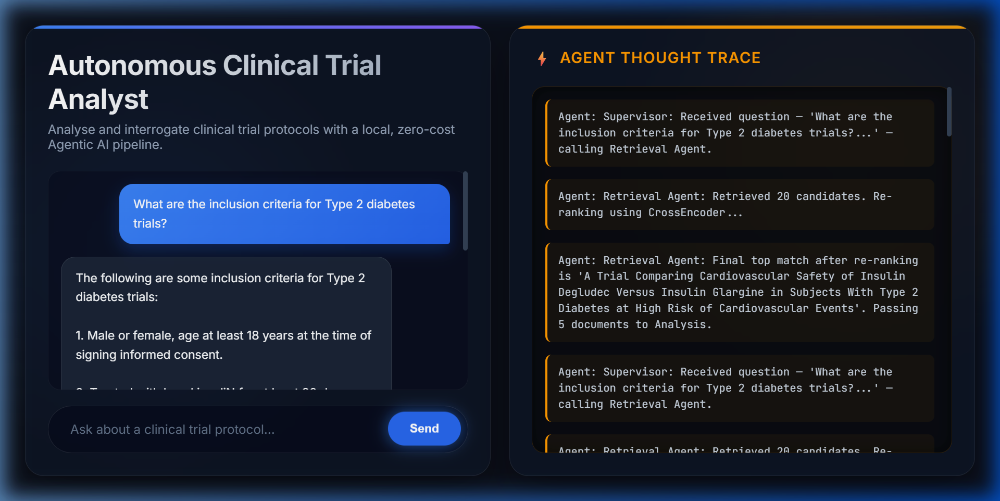

<p align="center">
  
  
  
  
</p>

# 🏥 Autonomous Clinical Trial Analyst

> **A multi-agent, self-reflecting RAG system that autonomously retrieves, re-ranks, analyses, and verifies answers from 200+ clinical trial protocols — running entirely on-device at zero cost.**

Built as an original GenAI project for the **Amazon ML Challenge 2026**, this application demonstrates production-grade Agentic AI engineering: a four-node LangGraph workflow with semantic retrieval, neural cross-encoder re-ranking, biomedical NLP entity extraction, and a self-reflection verification loop — all powered by local, open-source models without any paid API calls.

---

## 📸 Demo

<p align="center">
  
</p>

<p align="center"><em>The app answering a clinical question with the full Agent Thought Trace visible — showing Supervisor routing, CrossEncoder re-ranking of 20 candidates, and the Grader Agent's self-reflection approval.</em></p>

---

## 🏗️ System Architecture

```
┌──────────────────────────────────────────────────────────────────────┐
│                        FRONTEND (React + TypeScript)                 │
│                     Premium Dark-Mode UI on :3000                    │
│         ┌─────────────────────┐   ┌─────────────────────┐           │
│         │   💬 Chat Panel     │   │  🧠 Agent Thought   │           │
│         │   (User ↔ Agent)    │   │     Trace Panel      │           │
│         └─────────────────────┘   └─────────────────────┘           │
└──────────────────────┬───────────────────────────────────────────────┘
                       │ WebSocket (real-time streaming)
┌──────────────────────▼───────────────────────────────────────────────┐
│                    BACKEND (FastAPI + LangGraph)                      │
│                                                                      │
│  ┌─────────────┐   ┌──────────────┐   ┌──────────────┐   ┌────────┐│
│  │ 🎯 Supervisor│──▶│ 🔍 Retrieval │──▶│ 📊 Analysis  │──▶│ ✅ Grade││
│  │    Agent     │   │    Agent     │   │    Agent     │   │  Agent ││
│  └─────────────┘   └──────┬───────┘   └──────────────┘   └────────┘│
│                           │                                          │
│           ┌───────────────▼──────────────────┐                       │
│           │  CrossEncoder Re-Ranking (L-6)   │                       │
│           │  ms-marco-MiniLM-L-6-v2          │                       │
│           └──────────────────────────────────┘                       │
└──────────────────────┬───────────────────────────────────────────────┘
                       │
        ┌──────────────▼──────────────┐     ┌──────────────────────────┐
        │   🗃️ Qdrant Vector DB       │     │  🦙 Ollama (TinyLlama)   │
        │   384-dim Cosine Similarity │     │  Local LLM Inference     │
        │   + SciSpaCy NER Metadata   │     │  OpenAI-Compatible API   │
        └─────────────────────────────┘     └──────────────────────────┘
```

---

## ✨ Key Features & Technical Highlights

### 🤖 Multi-Agent LangGraph Workflow (4 Nodes)
| Agent | Role | Implementation |
|:------|:-----|:---------------|
| **Supervisor** | Routes queries, orchestrates the pipeline | Conditional edge routing in LangGraph |
| **Retrieval Agent** | Fetches top-20 candidates → re-ranks to top-5 | Qdrant vector search + CrossEncoder |
| **Analysis Agent** | Synthesizes clinical answers from protocol context | LLM with injected RAG context |
| **Grader Agent** | Self-reflection loop — verifies answer quality | Binary YES/NO hallucination check |

### 🧬 Advanced RAG Pipeline
- **Semantic Embeddings:** HuggingFace `all-MiniLM-L6-v2` (384-dim) replaces naive hashing with true contextual understanding
- **Neural Re-Ranking:** `cross-encoder/ms-marco-MiniLM-L-6-v2` performs pairwise query-document scoring on 20 candidates, surfacing the 5 most relevant protocols
- **Self-Reflection Grading:** A dedicated Grader Agent independently evaluates whether the generated answer addresses the user's question, flagging potential hallucinations before they reach the user

### 🏥 Biomedical NLP (SciSpaCy)
- **Medical Named Entity Recognition** using `en_core_sci_sm` — a neural model trained on biomedical corpora
- Automatically extracts diseases, drugs, procedures, and clinical terms during data ingestion
- Extracted entities are stored as structured metadata in Qdrant payloads for entity-aware retrieval

### 💰 Zero-Cost, Fully Local Architecture
- **No paid APIs.** No OpenAI, no AWS Bedrock, no cloud inference
- **LLM:** TinyLlama served locally via Ollama (OpenAI-compatible API)
- **Embeddings:** HuggingFace Sentence Transformers (runs on CPU)
- **Re-Ranker:** HuggingFace CrossEncoder (runs on CPU)
- **NLP:** SciSpaCy (runs on CPU)
- **Vector DB:** Qdrant (self-hosted via Docker)
- Entire system runs on a single laptop with 16GB RAM

### 🎨 Premium UI/UX
- Modern dark-mode glassmorphism design with smooth micro-animations
- Real-time **Agent Thought Trace** panel — watch the AI reason step-by-step
- WebSocket-powered streaming for instant feedback
- Premium typography (Inter + JetBrains Mono)

---

## 📊 Key Metrics

| Metric | Value |
|:-------|:------|
| **Retrieval Candidates** | Top-20 fetched → Re-ranked to Top-5 |
| **Embedding Dimensions** | 384 (all-MiniLM-L6-v2) |
| **Re-Ranker Model** | cross-encoder/ms-marco-MiniLM-L-6-v2 |
| **NER Model** | en_core_sci_sm (SciSpaCy) |
| **Protocols Ingested** | 200 diabetes clinical trials |
| **Data Source** | ClinicalTrials.gov API v2 |
| **Infrastructure Cost** | $0.00 (fully local) |
| **Agent Nodes** | 4 (Supervisor → Retrieval → Analysis → Grader) |

---

## 🛠️ Tech Stack

| Layer | Technology |
|:------|:-----------|
| **Frontend** | React 18, TypeScript, WebSocket, Vanilla CSS |
| **Backend** | FastAPI, LangGraph, LangChain |
| **LLM** | Ollama (TinyLlama) — local inference |
| **Embeddings** | HuggingFace `all-MiniLM-L6-v2` |
| **Re-Ranker** | HuggingFace `cross-encoder/ms-marco-MiniLM-L-6-v2` |
| **Medical NLP** | SciSpaCy `en_core_sci_sm` |
| **Vector DB** | Qdrant (persistent Docker volume) |
| **Containerization** | Docker Compose (3-service stack) |
| **Data Source** | ClinicalTrials.gov v2 API |

---

## 🚀 Quick Start

### Prerequisites
- Docker & Docker Compose
- Python 3.11+
- [Ollama](https://ollama.com/) installed

### 1. Start the Local LLM
```bash
ollama pull tinyllama
ollama serve
```

### 2. Launch the Full Stack
```bash
docker compose up --build
```
This starts **Qdrant** (port 6333), **Backend** (port 8000), and **Frontend** (port 3000).

### 3. Ingest Clinical Trial Data
In a separate terminal:
```bash
cd backend
python -m app.ingestion.ingest_diabetes_trials
```
This fetches trials from ClinicalTrials.gov, extracts biomedical entities via SciSpaCy, generates semantic embeddings, and upserts 200 protocols into Qdrant.

### 4. Open the App
Navigate to **http://localhost:3000** and start asking questions:
- *"What are the inclusion criteria for Type 2 diabetes trials?"*
- *"Which trials use metformin as a primary intervention?"*
- *"Compare safety endpoints across insulin therapy trials"*

Watch the **Agent Thought Trace** panel to see the Supervisor, Retrieval, Analysis, and Grader agents reason in real-time.

---

## 📁 Project Structure

```
Autonomous-Clinical-Trial-Analyst/
├── docker-compose.yml              # 3-service orchestration (Qdrant + Backend + Frontend)
├── README.md
│
├── backend/
│   ├── Dockerfile
│   ├── requirements.txt
│   └── app/
│       ├── config.py               # Runtime settings (Qdrant URL, Ollama endpoint)
│       ├── agents.py               # LangGraph workflow (4 agents + CrossEncoder + embeddings)
│       ├── main.py                 # FastAPI + WebSocket server
│       ├── data_get/
│       │   └── dataget.py          # ClinicalTrials.gov v2 API fetcher
│       └── ingestion/
│           └── ingest_diabetes_trials.py  # NLP pipeline: SciSpaCy NER + embeddings → Qdrant
│
└── frontend/
    ├── Dockerfile
    ├── package.json
    └── src/
        ├── index.html
        ├── index.tsx               # React app with WebSocket chat + trace panel
        └── styles.css              # Premium dark-mode glassmorphism design
```

---

## 🔬 How It Works (End-to-End Flow)

```
User Question
     │
     ▼
┌─────────────────────────────────┐
│  1. SUPERVISOR AGENT            │   Routes the query to the Retrieval Agent
└──────────────┬──────────────────┘
               ▼
┌─────────────────────────────────┐
│  2. RETRIEVAL AGENT             │   • Encodes query → 384-dim embedding
│     + CrossEncoder Re-Ranking   │   • Qdrant ANN search → top 20 candidates
│                                 │   • CrossEncoder re-scores all 20 pairs
│                                 │   • Returns top 5 most relevant protocols
└──────────────┬──────────────────┘
               ▼
┌─────────────────────────────────┐
│  3. ANALYSIS AGENT              │   • Injects top-5 protocols as context
│                                 │   • LLM generates a grounded clinical answer
└──────────────┬──────────────────┘
               ▼
┌─────────────────────────────────┐
│  4. GRADER AGENT                │   • Self-reflection: "Does this answer
│     (Self-Reflection Loop)      │     actually address the question?"
│                                 │   • YES → Approved for user
│                                 │   • NO  → Flagged with warning
└──────────────┬──────────────────┘
               ▼
         Final Answer
    (displayed in chat UI)
```

---

## 🧪 Data Ingestion Pipeline

The ingestion script (`ingest_diabetes_trials.py`) performs the following:

1. **Fetch** — Pulls clinical trial protocols from the ClinicalTrials.gov v2 API
2. **Extract** — Runs SciSpaCy NER to identify diseases, drugs, and procedures
3. **Embed** — Generates 384-dimensional semantic embeddings via `all-MiniLM-L6-v2`
4. **Store** — Upserts vectors + rich metadata (title, content, entities) into Qdrant

---

## 📝 Notes

- The app currently focuses on diabetes-related trials; modify `dataget.py` and `ingest_diabetes_trials.py` to ingest other conditions
- All model calls are local via Ollama; swap TinyLlama for Llama 3 8B or Phi-3 by changing the `model` parameter in `agents.py`
- Qdrant data is persisted via Docker volumes — no need to re-ingest after restarts

---

## 📄 License

MIT

---

<p align="center">
  <strong>Built with ❤️ for the Amazon ML Challenge 2026</strong>
</p>
